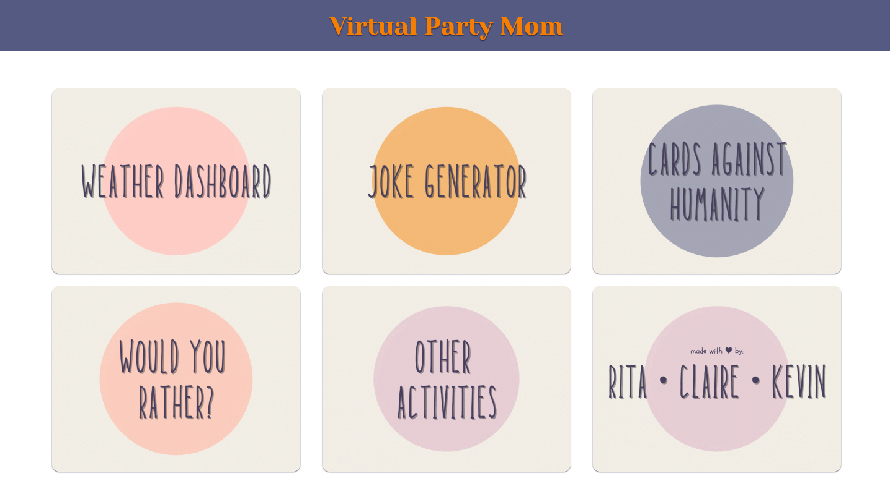
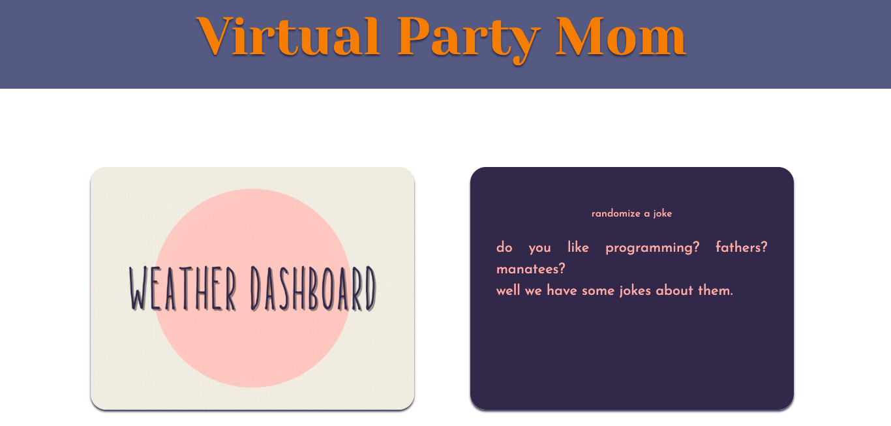
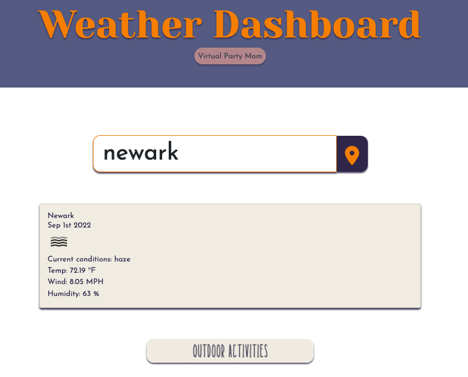
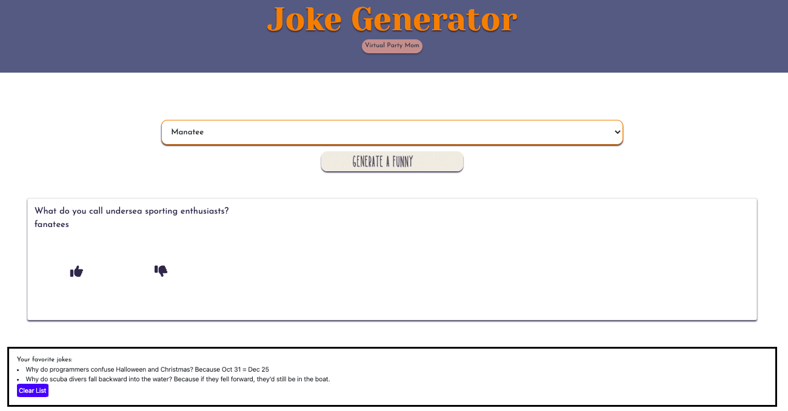
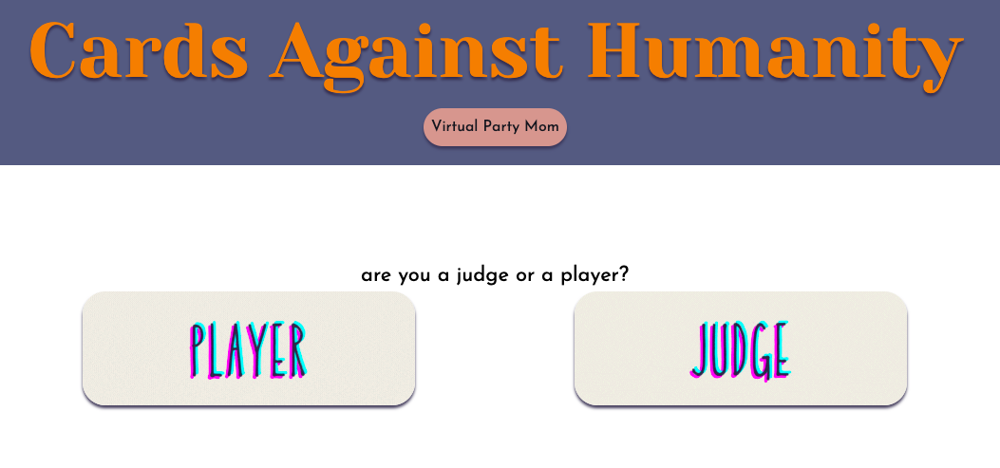
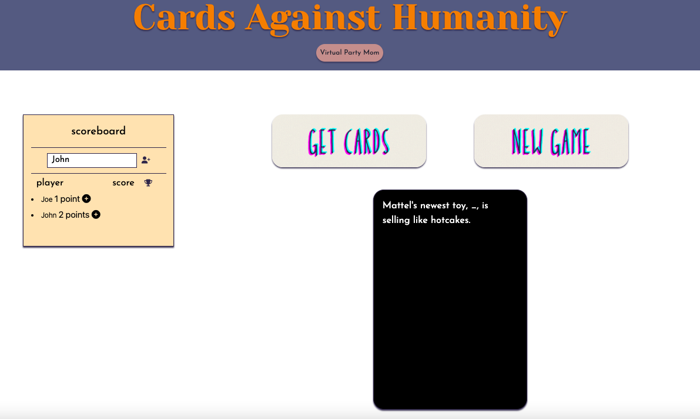
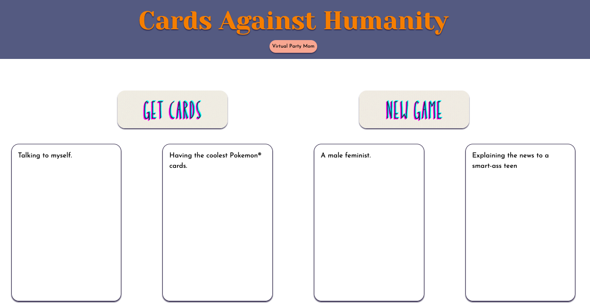
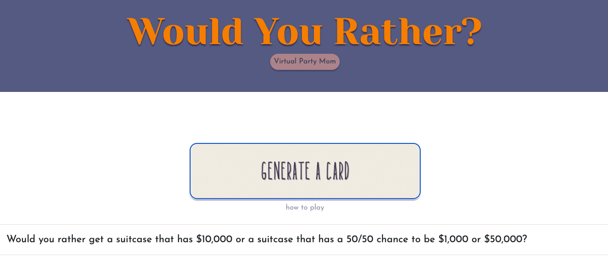
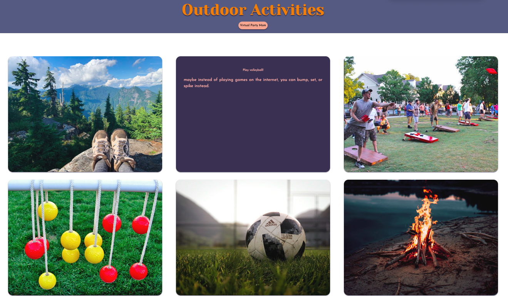

# Virtual Party Mom

## Description

The purpose of this application is to provide a virtual tool to use at group gatherings. This tool allows the user to check the weather, and then retrieve suggestions for group activities based on the current weather conditions. This application includes a joke generator, a Cards Against Humanity game, a Would You Rather? game, and a section with suggestions for outdoor activities. The motivation behind this project stemmed from our desire to be able to provide entertainment at group gatherings when ideas and/or physical game cards are lacking. Throughout the course of building this project, we learned how to effectively collaborate and work in separate GitHub branches. We learned how to resolve merge conflicts and handle other Git issues without breaking the codebase in our main branch. In the future, we plan to continually update this application to make it more user-interactive as we learn more technical skills. One feature in particular that we would like to add is the ability to play Cards Against Humanity on one screen against the computer, rather than having each user play on their own device. We would also like to add a feature that allows the game to end automatically once a certain player reaches a certain score, rather than having the game ended manually by the user.

## Table of Contents

- [Installation](#installation)
- [Usage](#usage)
    - [Weather Dashboard](#weather-dashboard)
    - [Joke Generator](#joke-generator)
    - [Card Against Humanity](#cards-against-humanity)
    - [Would You Rather?](#would-you-rather)
    - [Outdoor Activities](#outdoor-activities)
- [Credits](#credits)
- [License](#license)

## Installation

N/A

## Usage

To access the application, visit the following URL: [https://rpecuch.github.io/virtual-party/](https://rpecuch.github.io/virtual-party/). 

Hover over any feature to view a description. Click on any feature to access it.

### Weather Dashboard

To check the current weather conditions in your location, visit the "Check the Weather" section. Simply type the name of your city in the search box. The user can then decide if they would like to pick an outdoor or indoor activity for their group. To select an outdoor activity, click "Outdoor Activities". To be redirected to the homepage to select and indoor activity, click "Virtual Party Mom" at the top of the page. The user can search for as many cities as they would like to.

### Joke Generator

To have a random joke generated to tell your group, visit the "Randomize a Joke" section. Use the drop-down menu to select the topic of the joke. Users will have the option to like or dislike each joke, and liked jokes will be saved to local storage! A list of all liked jokes will be retrieved from local storage and displayed. To be directed back to the website homepage, click "Virtual Party Mom" at the top of the page.

### Cards Against Humanity

To play Cards Against Humanity, visit the "Play Cards Against Humanity" section. Each user will have the option to select the judge or a player role. The user will also have an option to view game instructions. To be directed back to the website homepage, click "Virtual Party Mom" at the top of the page.

As a judge, the user will click the "Generate Card" button each round to select a black card (judges card). After the other users show their cards that they are playing, the judge can type in the name of the player that won that round. The judge can also add points to each player's score. When the game is over, simply click "New Game" and each user can decide if they are a player or judge for the next game. To be directed back to the website homepage, click "Virtual Party Mom" at the top of the page.

As a player, the user will click the "Get Cards" button to draw five white cards (player cards). After the judge shows the black card for the round, the user will click on the card in their hand that they want to play. Clicking on the card will hide the rest of their hand from view so that other users cannot see the remaining cards. After the judge selects a winner, the user can click on the "x" icon on the card to discard it. They will then choose from their remaining cards during the next round. The game is over when all cards have been played. When the game is over, simply click "New Game" and each user can decide if they are a player or judge for the next game. To be directed back to the website homepage, click "Virtual Party Mom" at the top of the page.

### Would You Rather?

To play Would You Rather?, visit the "Play Would You Rather?" section. Users will have the option to view the game instructions or generate a game card to discuss with the group. Users can play as many rounds as they would like. To be directed back to the website homepage, click "Virtual Party Mom" at the top of the page.

### Outdoor Activities

To view a list of suggestions for outdoor group activities, visit the "Other Activities" section. Hover over any image to view a description. To be directed back to the website homepage, click "Virtual Party Mom" at the top of the page.

## Credits

### Collaborators

Kevin Crespo: 
- GitHub username: Kcrespo15
- [GitHub profile](https://github.com/Kcrespo15)

Clarence Go:
- GitHub username: cmariego97
- [GitHub profile](https://github.com/cmariego97)

### Third-Party APIs

The following client-side APIs were used to build this project: Bootstrap, Tailwind CSS, Moment.js, Google Fonts, and Font Awesome.

The following server-side APIs were used to retrieve data for this project: OpenWeather One Call API, JokeAPI, manatee jokes API, papajoke API, Cards Against Humanity API, and Would You Rather API.

## License

Please refer to the license in the repo.